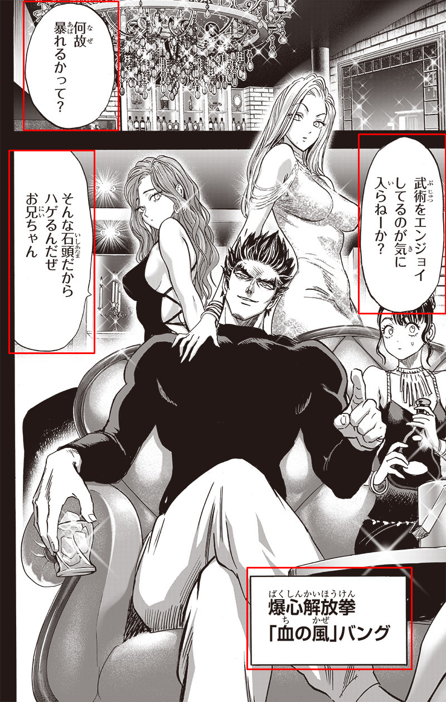
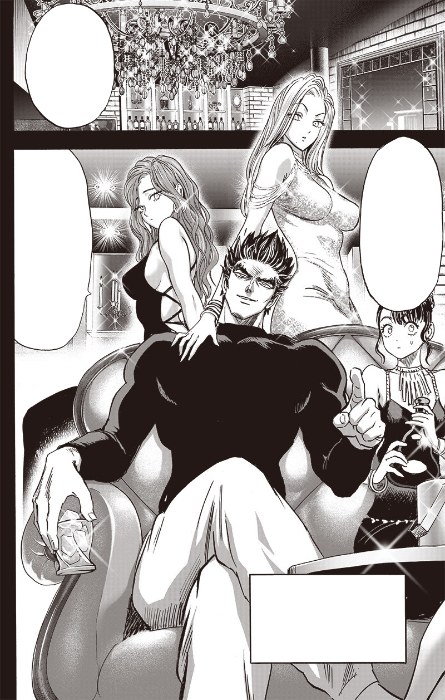
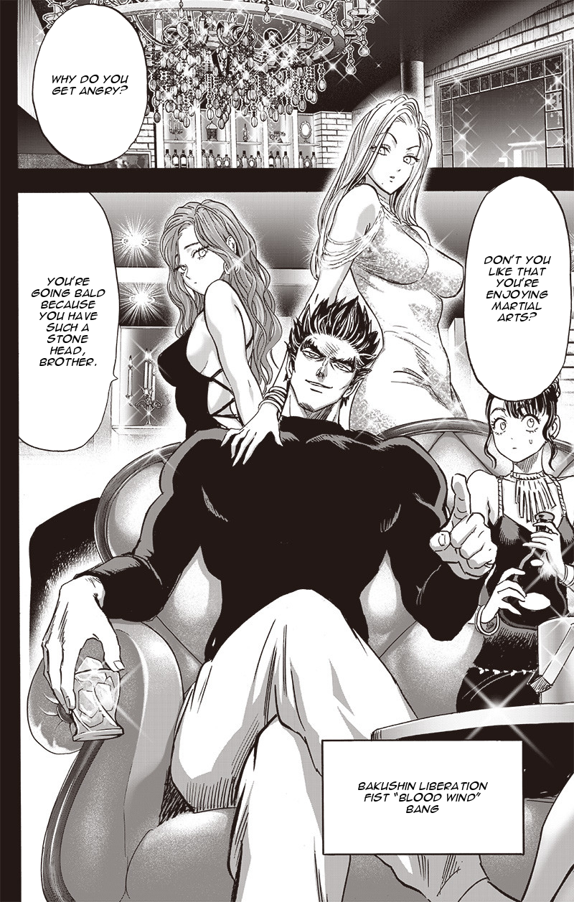
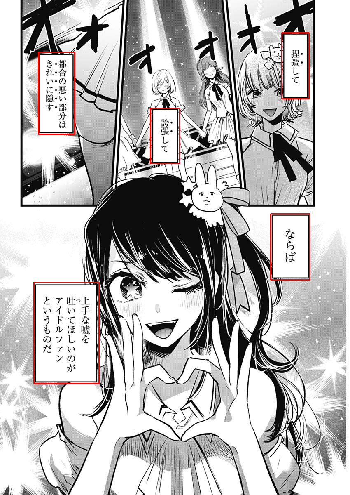
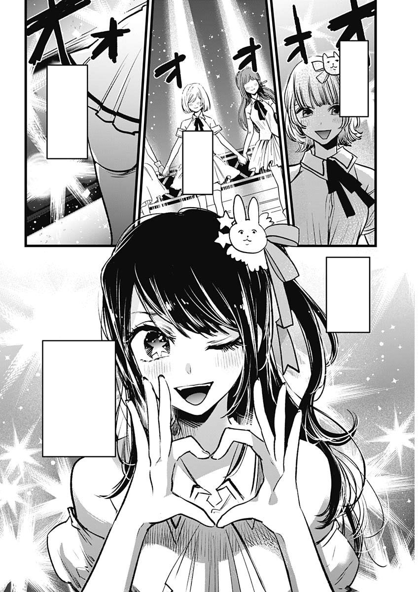
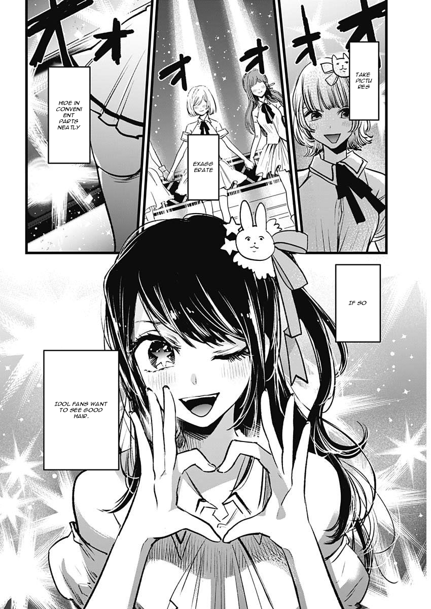

# Manga Translator

Python tool for translating text found within speech bubbles in manga images. It utilizes YOLOv8 for bubble detection, MangaOCR for text extraction, and translation services like google and Helsinki-NLP's opus-mt-ja-en model for text translation.

## How it works

- Detect speech bubbles in manga images.
- Extract text from detected speech bubbles.
- Clear speech bubbles for better visualization.
- Translate extracted text to the desired language.
- Add translated text back into the speech bubbles.

## Dataset

<a href="https://universe.roboflow.com/luciano-bastos-nunes/mangas-bubble">
    </img>
</a>
<br>
<a href="https://universe.roboflow.com/sheepymeh/manga-vd5mb/">
    </img>
</a>

## Installation

1. Clone this repository:

    ```bash
    git clone https://github.com/your_username/manga-translator.git
    ```

2. Install the required dependencies:

    ```bash
    pip install -r requirements.txt
    ```

## Usage

1. Navigate to the directory where you cloned the repository:

    ```bash
    cd manga-translator
    ```

2. Run the `manga_translator.py` script with the required arguments:

    ```bash
    python manga_translator.py --model-path /path/to/model --image-path /path/to/image --font-path /path/to/font --translator [google/hf] --save-path /path/to/save
    ```

    Replace the arguments as follows:
    - `/path/to/model`: Path to the YOLO model.
    - `/path/to/image`: Path to the input manga image.
    - `/path/to/font`: Path to the font file for adding text. (default: "fonts/animeace_i.ttf")
    - `[google/hf]`: Choose the translation service, either "google" for Google Translator or "hf" for Helsinki-NLP. (default: "google")
    - `/path/to/save`: Path to save the output image.

## Demo

<a href="https://huggingface.co/spaces/georgescutelnicu/MangaTranslator">
    </img>
</a>

## Examples

## 1

| Original Image | Bubbles Detection |
|:-----------------:|:-----------------:|
|  |  |

| Clear Bubbles | Add translation |
|:-----------------:|:-----------------:|
|  |  |

## 2

| Original Image | Bubbles Detection |
|:-----------------:|:-----------------:|
|  |  |

| Clear Bubbles | Add translation |
|:-----------------:|:-----------------:|
|  |  |

## License

This project is licensed under the MIT License.
